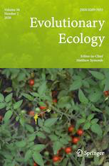

 

Please see my <a href="https://scholar.google.com/citations?user=EmLgNEEAAAAJ&hl=en">Google Scholar</a> page for an up-to-date list of my publications

 

\* Equal contribution

#### *In review/revision*

**Gibson, M.J.S.**, Torres, M.L., Brandvain, Y., & Moyle, L.C. (2020). Reconstructing the history and biological consequences of a plant invasion on the Galapagos islands. [BioRxiv: <a href="https://doi.org/10.1101/2020.09.26.313627">2020.09.26.313627</a>

Hibbins, M.S., **Gibson, M.J.S.**, & Hahn, M.W. (2020). Determining the probability of hemiplasy in the presence of incomplete lineage sorting and introgression.  [BioRxiv: <a href="https://doi.org/10.1101/2020.04.15.043752 ">10.1101/2020.04.15.043752</a>]

#### *Peer-reviewed publications*

**Gibson, M.J.S.** & Moyle, L.C. (2020). Regional differences in the abiotic environment contribute to genomic divergence within a wild tomato species. *Molecular Ecology*. [doi: <a href="https://doi.org/10.1111/mec.15477">10.1111/mec.15477</a>] [BioRxiv: <a href="https://doi.org/10.1101/744797">10.1101/744797</a>]

**Gibson, M.J.S.\***, Crawford, D.J.\*, Holder, M.T.\*, Mort, M.E., Kerbs, B., Menzes de Sequeira, M., Kelly, J.K. (2020). Genome-wide genotyping estimates mating system parameters in the island species Tolpis succulenta. *In press at American Journal of Botany*

{:width="100" align="right"}
**Gibson, M.J.S.** & Torres, M.L., & Moyle, L.C. (2020). Local extirpation is pervasive among populations of Galapagos endemic tomatoes. *Evolutionary Ecology*. [doi: <a href="https://doi.org/10.1007/s10682-020-10035-3">10.1007/s10682-020-10035-3</a>]  [BioRxiv: <a href="https://doi.org/10.1101/814160">10.1101/814160</a>] \***Cover Article**

Jewell, C.P., Zhang, S., **Gibson, M.J.S.**, Tovar-Mendez, A., McClure, B., & Moyle, L.C. (2020). Intraspecific standing variation underlying reproductive barriers between species in the wild tomato clade (Solanum sect. Lycopersicon). *Journal of Heredity*. esaa003: 1-11. [doi: <a href="https://doi.org/10.1093/jhered/esaa003">10.1007/s10682-020-10035-3</a>]  [BioRxiv: <a href="https://doi.org/10.1101/718544">10.1101/718544</a>]

Kostyun, J.L., **Gibson, M.J.S.**, King, C.M., & Moyle, L.C. (2019). A simple genetic architecture and low constraint allows rapid floral evolution in a diverse and recently radiating plant genus. *New Phytologist* 223(2): 1009-1022. [doi: <a href="https://doi.org/10.1111/nph.15844">10.1111/nph.15844</a>]

Kerbs, B., Ressler, J., Kelly, J.K., Mort, M.E., Santos-Guerra, A., **Gibson, M.J.S.**, Caujape-Castells, J., & Crawford, D.J. (2017). Variation in synthetic interspecific hybrids of Tolpis (Asteraceae) in the Canary Islands: novel character combinations, transgressive traits, and phenotypic lines. *AoB Plants*. 9(5): plx043. [doi: <a href="https://doi.org/10.1093/aobpla/plx043">10.1093/aobpla/plx043</a>]
