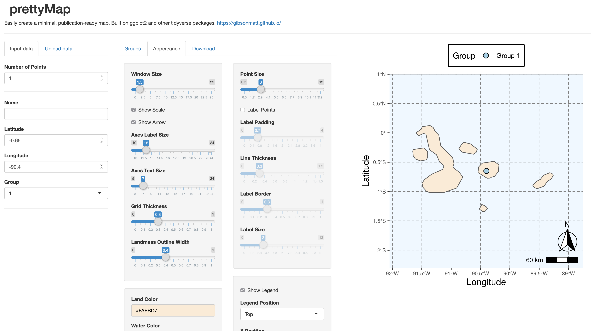

### Links

<a href="field_sites.html">Interactive map of Galapagos field sites</a> 
<a href="http://tgrc.ucdavis.edu">Tomato Genetics Resource Center</a> 
<a href="AboutPageAssets/vids/mockingbird_2019.mp4"> Galapagos Mockingbird eating *S. cheesmaniae* fruits</a>
 

### Software

<a href="https://github.com/mhibbins/HeIST">HeIST: Hemiplasy Inference Simulation Tool</a> 

### Utilities

<a href="https://github.com/gibsonMatt/stacks-pairwise">stacks-pairwise: Calculate pairwise divergence between samples from Stacks RAD genotyping output</a> 

### Shiny Apps

<a href="https://gibsonmatt.shinyapps.io/mvnselection/">mvnselection: Simulate allele frequency divergence using a multivariate normal</a> 
{:width="500" align="right"}
<a href="https://gibsonmatt.shinyapps.io/prettymap/">prettymap: Make publication-ready maps using ggplot</a>

### Data

<a href="AboutPageAssets/files/ckh_1948_tidy.csv"> Data from Clausen, Keck, & Hiesey (1948) in tidy format</a>

### Grant Proposals

<a href="AboutPageAssets/files/2021_Gibson_NIFA.pdf">2021 NIFA project narrative</a>